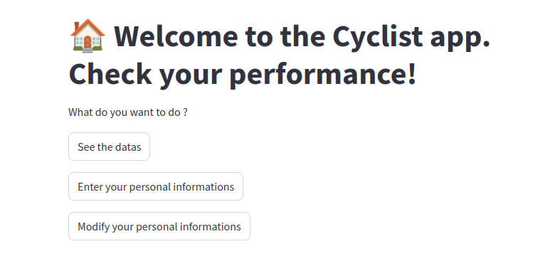
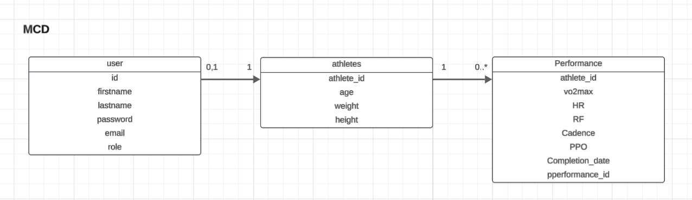
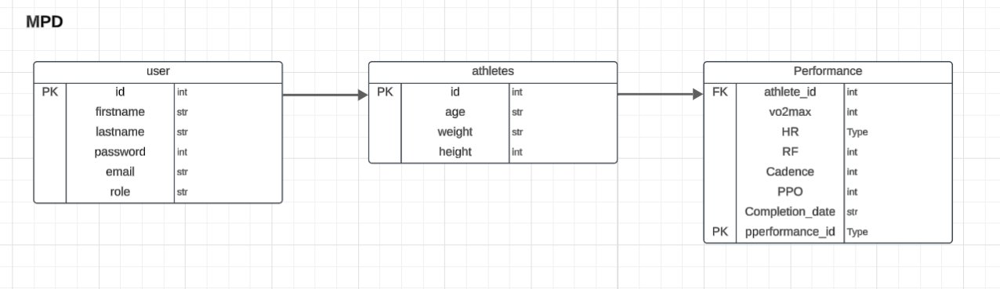
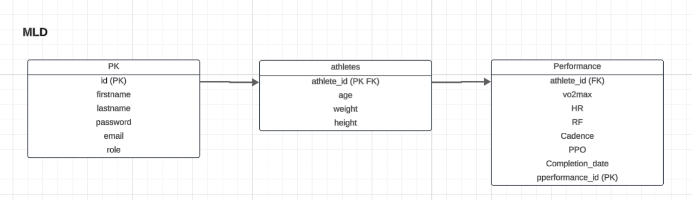

# <p align="center">Cyclist performance management</p>

<!-- <p align="center">
    
</p> -->

## ➔ Table of Contents

* [➔ Project Structure](#-project-structure)
* [➔ How to Run](#-how-to-run)
* [➔ Requirements](#-requirements)
* [➔ Evaluation Criteria](#-evaluation-criteria)
* [➔ Database Models](#-database-models)
* [➔ License](#-license)
* [➔ Authors](#-authors)

---

## Project Structure

This project includes the following main files and modules:

- **app/**
    - **main.py** : Entry point for the FastAPI application.
    - **endpoints/** :
        - **athlete.py** : Defines athlete endpoints (creation, modification).
        - **connexion.py** : Endpoints for user connexion and get information on the connected user.
        - **modification_user.py** : Endpoint to modify user information.
        - **performance.py** : Endpoints to create and modify a performance.
        - **performance.py** : Creates a new user.
        - **performance.py** : Creates a new user.
        - **statistics.py** : Get the general statistics of all the athletes registered in the database.
    - **models/** :
        - **models.py** : Brings together all the functions needed to add, update, and delete informations in the database.
    - **core/** :
        - **security.py** : Utility functions for authentication, password hashing, and JWT.
        - **ml_model.py** : Contains the machine learning model for loan eligibility prediction.
        - **config.py** : Application configuration settings.
    - **streamlit/** :
        - **utils.py** : Utility functions to run streamlit pages and ensure connexions with API.
        - **app.py** : Entry point for the streamlit application.
        - **pages/** : Stores all the necessary files to run streamlit.
    - **Fill_athlete_user_table.py** : Allows to fill the database with fake datas.
    - **fill_athlete_user_table.py** : Allows to fill the database JSON datas from https://www.kaggle.com/datasets/andreazignoli/cycling-vo2/data.

---

## How to Run

Follow these steps to run the project:

1. Ensure Python >= 3.9 is installed on your system.
2. Clone this repository to your local machine:

```bash
    git clone https://github.com/Daviddavid-sudo/Gestion-des-Performances-des-Cyclistes-Professionnels.git
```
3. Navigate to the project directory:

```bash
    cd Gestion-des-Performances-des-Cyclistes-Professionnels
```
4. Install the required dependencies:

```bash
    pip install -r requirements.txt
```
5. Fill the database :

```bash
    python Fill_athlete_user_table.py
```
5. (bis, Optional) Add some Performances Datas:

```bash
    python fill_athlete_user_table.py
```
6. Run the FastAPI application:

```bash
    uvicorn app.main:app --reload
```
7. In an new terminal, navigate to the project directory:

```bash
    cd ..
    cd streamlit
```
8. Run the Streamlit application

```bash
    streamlit run app.py
```
---

## Requirements

List of required software and libraries:

- Python >= 3.9
- fastapi
- streamlit
- passlib
- uvicorn
- dotenv
- jose
- jwt
- bcrypt
- python-jose
- email-validator

---

## Evaluation Criteria

### Educational Requirements
- Group of 2 members
- Duration: 1 weeks

### Assessment Methods
- Peer code review

### Deliverables
- Link to the GitHub repository for the API and streamlit (bonus)

---

## Performance Metrics

- The application and API meet the project requirements.
- No obvious security vulnerabilities.

---

## Database Models

### Conceptual Data Model (CDM)

<p align="center">
    
</p>

### Physical Data Model (PDM)

<p align="center">
    
</p>

### Logical Data Model (LDM)

<p align="center">
    
</p>

---

## License

[MIT License](LICENSE)

---

## Authors

- **David Scott**
  <a href="https://github.com/Daviddavid-sudo" target="_blank">
      
  </a>

- **Ludivine Raby**
  <a href="https://github.com/ludivineRB" target="_blank">
      
  </a>

---